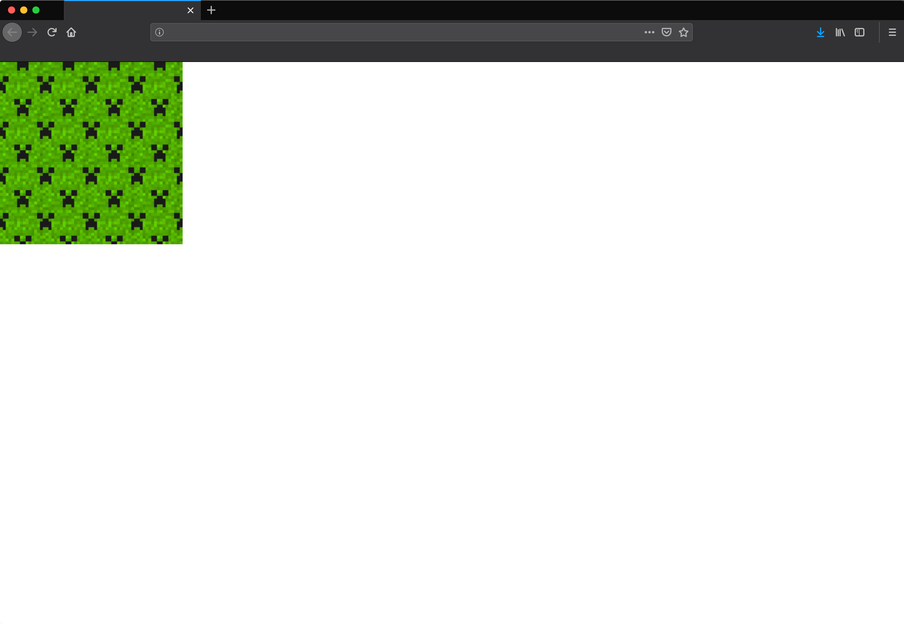
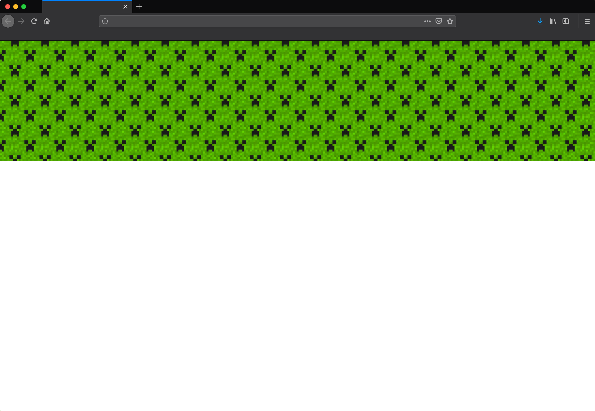
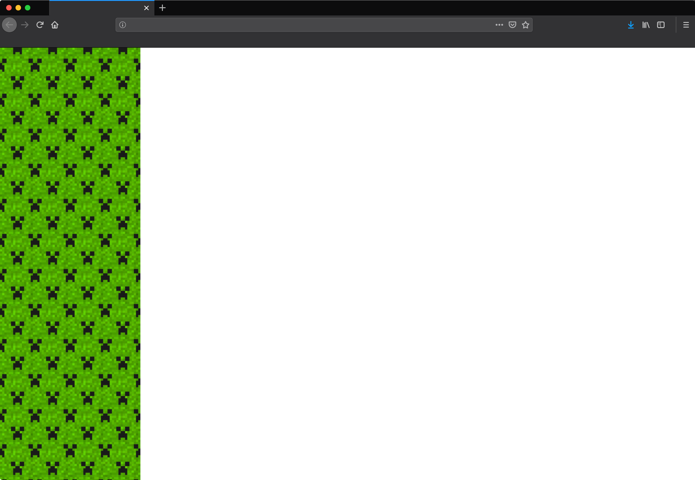
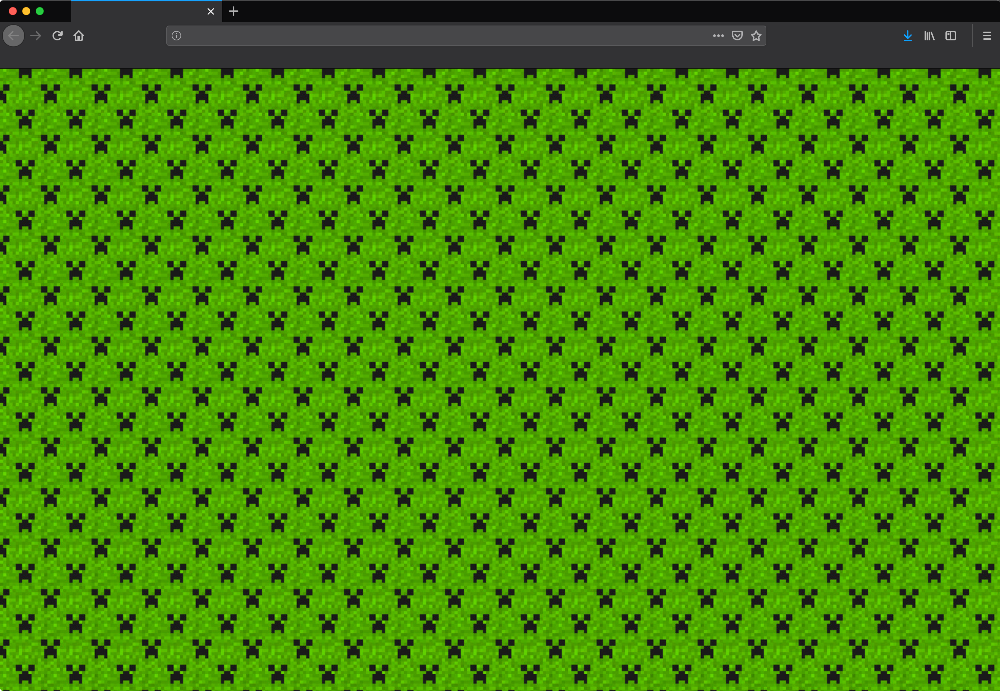
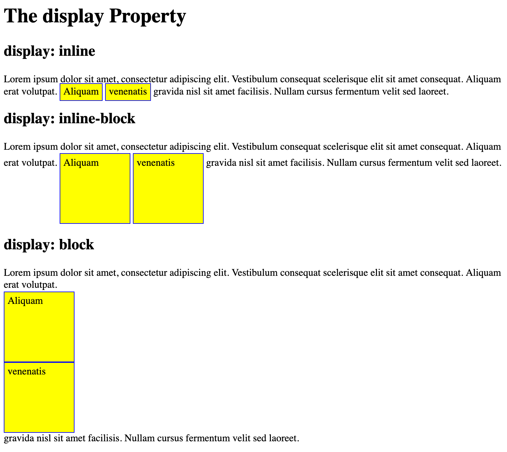
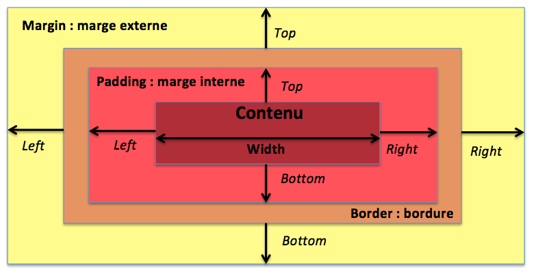
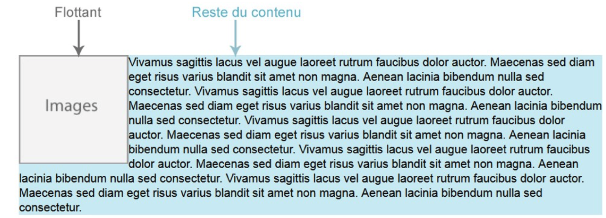
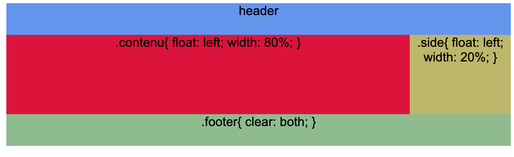

# Les propriétés CSS

Alors, on va faire au plus court, car des propriétés il y en a beaucoup... vraiment beaucoup. On va en voir quelques une très rapidement, il vous faudra fouiller la documentation CSS pour en trouver d'autre. N'hésitez pas non plus a faire des recherches Google pour trouver ce que vous souhaitez comme effet.

## Typographie

### font-family

```css
body{
  font-family: Arial, Helvetica, sans-serif;
}
```

Définit la famille de police d'écriture à utiliser. Dans cet exemple, tout texte dans le **body** de votre page utilisera Arial en priorité, ensuite Helvetica si la police n'est pas disponible et pour finir n'importe quelle police sans-serif si les deux première ne sont pas sur l'ordinateur de l'utilisateur.

Voici une liste des polices dites "safe" à utiliser sur vos pages web: [https://www.cssfontstack.com/]

> :bulb: Mettez les liens dont on vous parle en favoris sur votre navigateur pour pouvoir les consulter plus tard en cas de besoin

Il est également possible d'utiliser les [polices Google](https://fonts.google.com/), qui sont très nombreuses. Les intégrer n'est pas très compliqué, on verra cela plus tard, mais si vous voulez essayer, n'hésitez pas!


### font-size

```css
body{
  font-size: 18px;
}
```

Définit la taille (hauteur) d'une police. On peut utiliser plusieurs unités (px, em,...)

## font-weight

```css
body{
  font-weight: bold;
}
```

Définit l'épaisseur de notre police. Vous pouvez utiliser une valeur (de 100 à 900) ou un mot clé (bold, thin, normal,...), jetez un coup d'oeil aux propriétés complète [ici](https://www.w3schools.com/cssref/pr_font_weight.asp)

### font-style

```css
body{
  font-style: italic;
}
```

Permet de mettre les élements en italique.

### line-height

```css
body{
  line-height: 1.5
}
```

Permet de gérer l'interlignage.

### color

```css
body{
  color: red;
}
p{
  color: #222222;
}
```

Définit la couleur de l'élément. Prends un valeur hexadécimale ou un mot-clé (red, gray,...)

### text-align

```css
p{
  text-align: right;
}
```

Permet d'aligner le texte, les valeurs sont: **left**, **right**, **center**, **justify** (comme sur Word).

> :bulb: Pour aligner une image, on peut la mettre dans un \<div> ou \<p> qui est aligné avec **text-align**

### text-transform

```css
h1{
  text-transform: capitalize;
}
```

Permet de modifier le texte pour le mettre en majuscule ou en minuscule. Prends les valeurs: **none**, **capitalize**, **uppercase**, **lowercase**

### text-decoration

```css
p{
  text-decoration: underline;
}
```

Ajoute différentes "décoration" au texte comme le soulignement. Les valeurs possible sont: **none**, **overline**, **underline**, **line-through**


## Bordure et arrière-plan

### border

```css
h2{
  border: 5px solid #6f1be4;
}
```

Border prend 3 sous-propriétés:

* width : l'épaisseur du contour en px
* style: le style: solid (ligne continue), dotted (pointillés),... [D'autre styles sont possible](https://www.w3schools.com/cssref/pr_border-style.asp)
* color: la couleur de la bordure

> :bulb: On peut divisier la bordure en 4 côté
>
> border-top: ...;
>
> border-bottom: ...;
>
> border-left: ...;
>
> border-right: ...;

### border-radius

```css
h2{
  border: 5px;
  border-radius: 10px;
}
```

Définit un arrondis pour la bordure. Ne sert à rien si la propriété **border** n'est pas présente.

> :bulb: Comme pour la bordure, il est possible de définir un arrondis que pour certains coins. 
>
> On écrit cela comme ça: border-radius: 2px 20px 5px 14px; La première valeur commence en haut à gauche, puis suit les coins dans le sens horloger.

### bacground-color

```css
h2{
  background-color: red;
}
```

Permet de définir un fond de couleur pour le bloc sélectionné.

### backgound-image

```css
div{
  background-image: url("img/bg.png");
}
```

Place une image en arrière-plan du bloc sélectionné.

### background-repeat

```css
body{
  background-repeat: no-repeat;
}
body{
  background-repeat: repeat-x;
}
```






Définit la répétition d'une image d'arrière-plan si le conteneur est plus grand que l'image. Prends les valeurs suivantes: **no-repeat**, **repeat-x**, **repeat-y**, **repeat**.

> :link: Un exemple [de pattern repeat en background](https://leaverou.github.io/css3patterns/#), mais sans image, tout est généré en CSS
> 
> :link: Des [textures répétable](https://www.toptal.com/designers/subtlepatterns/) pour vos fonds de page

### background-position

```css
body{
  background-position: center;
}
```

Permet de donner la position de l'image de fond par rapport au coin haut gauche. S'utilise avec **no-repeat**

### background-attachement

```css
body{
  background-attachement: fixed;
}
```

Permet de faire défilé ou non l'image de background avec la page ou non. Par défaut la valeur est: **scroll**

### En une ligne

Il est possible d'insérer toutes les propriétés de background sur une seule ligne pour gagner en place dans votre code.

```css
body{
  background: #6f1be4 url("img/image.png") no-repeat center;
}
```

## Dimensions, margin et padding

### Inline et block

Sans CSS, les éléments d'un block prennent toute la largeur de leur parent et sont suivis d'un retour à la ligne (body, html, p, div,...)

Les éléments inline (span, a, strong, img,...) prennent la largeur de leur contenu et ne sont pas suivis d'unretour à la ligne.



### width & height (max & min)

> width = largeur
>
> height = hauteur

Prends comme valeurs: **auto**, **px**, **%** ou **em**

Il est également possible de préciser une valeur minimim ou maximum pour ces tailles.

```css
img{
  max-width: 100px;
}
```

> Dans cet exemple, l'image ne ferra jamais plus de 100 px de large.

### margin & padding



```css
.same{
  margin: 10px;
  padding: 5px;
}
.different{
  margin-top: 10px;
  margin-bottom: 10px;
  margin-left: 5px;
  margin-right: 2px;
}
```

Ce qu'il faut retenir:

* Padding: marge intérieur
* Margin: marge extérieur
* Par défaut la valeur s'applique sur chaque côté (top, right, bottom, left) mais il est possible de préciser une valeur différente pour chaque côté.
* Peut s'écrire en une seule ligne (top, right, bottom, left)

## Positionnements

### float

```css
.img{
  float:left;
}
```

Permet de placer un contenu en dehors du "flux" de la page et le reste des blocks "coule" autour. Prends **left**, **right** ou **none** comme valeur.



### clear

```css
.texte{
  clear: both;
}
```

Permet d'empêcher le contournement des blocs flottants. Prends **left**, **right** ou **both** comme valeur.




### display

Cette propriété va permettre une mise en forme avancée. Voici quelques valeurs possibles: **block**, **inline**, **inline-block**, **none**,... Certaines de ces valeurs sont appliquées par défaut en fonction des éléments (par exemple un \<p> ou un \<div> prend par défaut un **display:block**)

### display: block

```css
a{
  display: block;
}
```

Permet de changer les éléments **inline** en block. Par défaut il prend toute la largeur de son parent et est suivi d'un retour à la ligne.

### display: inline

```css
p{
  display: inline;
}
```

Permet de transformer l'élement en type inline ce qui aura pour effet de le laisser sur une seule ligne.

### display: none

```css
img{
  display: none;
}
```

Permet de retirer un élement de la page. Il ne sera plus visible et ne prendra plus de place. 

### position

Cette propriété permet de positionner les éléments dans la page. Prends comme valeurs: **static**, **relative**, **absolute** ou **fixed**

### position: static

Valeur par défaut de tous les éléments. Un élément avec position static n'est positionné d'aucune manière spéciale.

### position: relative

```css
.content a {
  position: relative;
  top: -15px
}
```

Un élément se comporte de la même manière que avec static. On peut se servir des propriétés **top**, **left**, **right**, **bottom** pour déplacer l'élement. Le reste du contenu ne sera pas affecté.

### position: fixed

```css
.nav {
  position:fixed;
  top: 0;
  left: 0;
  right: 0;
}
```

Un élément positionné avec **fixed** ne bougera pas. Il sortira du flux de la page et se positionnera par dessus les autres éléments et ce même si on fait défiler la page. Sa position est définie par rapport à l'espace affichable par le navigateur.

### position: absolute

Un élément en position absolute sort du flux et se positionne par rapport à son dernier ancêtre positionné. Si aucun ancêtre n'est positionné, il se positionnera par rapport à \<html>. On doit positionner le parent avec une position relative, fixed ou absolute.


```css
h2 {
  position: absolute;
  left: 100px;
  top: 150px;
}
```

## Flexbox

On vient de voir pas mal de propriété. Vous devriez être capable de réaliser l'exercice de la semaine, mais il me reste à vous parler de Flexbox.

Flexbox est un outil qui permet une certaine flexibilité dans la mise en page de vos éléments. Le principe est simple, on place nos éléments dans un conteneur (une \<div>) et on gère le comportement de nos éléments au sein de ce conteneur via les propriétés de flexbox.

Le meilleur moyen pour comprendre flexbox c'est de l'expérimenté par vous même. Je vous recommande la lecteur des deux sites suivants:

>[CSS-Tricks](https://css-tricks.com/snippets/css/a-guide-to-flexbox/)
> 
>[Openclassroom](https://openclassrooms.com/fr/courses/1603881-apprenez-a-creer-votre-site-web-avec-html5-et-css3/3298561-faites-votre-mise-en-page-avec-flexbox)

## L'auto-complete de VSCode

Si vous ne savez pas exactement quelle propriété existe ou comment elle s'écrit, VSCode est là pour vous aider. En effet quand vous travaillez dans un document CSS ou HTML enregistré, VSCode détecte votre syntaxe et vous aide à compléter votre frappe.