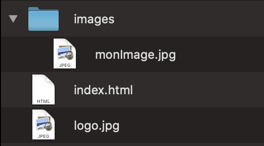

# Quelques balises pour mettre en forme

Maintenant qu'on en sait un peu plus sur comment est structuré une page web basique, voyons un peu comment mettre tous ça en page.

Il existe une multitude de balises à utiliser pour rédiger un document HTML, nous verrons les plus utiles. Surtout n'hésite pas à consulter la documentation officielle pour en savoir plus et en découvrir d'autre.

> :bulb: Ouvrez VS code et expérimentez les balises qu'on va voir à partir d'ici. Pas besoin de grand chose, juste un fichier .html avec ces balises suffiront ou tu peux reprendre le squelette créer précédemment.

## La balise \<div>

La **div**ision est un conteneur. Cette balise permet de structurer sa page en "bloc". On a généralement un bloc "header", "content", "sidebar" et "footer". Dans ces balises on insérera le contenu adéquat.

```html
<div id="header">
  <p>contenu du header</p>
</div>
```

> :wrench: Vite fait, voyons ce que sont ces blocs:

* Header: c'est la tête de votre page, dans ce bloc on va insérer le logo de notre site ainsi qu'un menu. Il se trouve en haut de la page.
* Content: c'est le contenu de notre page, tous les textes et images que les visiteurs verront. En fonction de la masse de contenu à afficher, il peut être judicieux d'imbriquer d'autres blocs à l'intérieur de content pour une meilleur organisation ou pour styliser votre contenu autrement (exemple: "mes diplômes", "mon parcours", "mes skills",...)
* Sidebar: n'est pas toujours présent, sert a insérer un menu sur le côté ou tout autre contenu qui doit apparaître à côté du content.
* Footer: c'est le pied de page, c'est là qu'on marque les copyrights, qu'on insère un menu ou quelques informations supplémentaires.

> Tout ceci n'est pas à respecter à la lettre. Vous pouvez casser les codes, mais attention, soyez sûr de ce que vous faites. :smile:

## La balise \<p>

P pour paragraphe, c'est la balise la plus courante pour rédiger du texte. C'est un bloc qui est suivis d'un saut à la ligne. On peut mettre la balise \<p> dans un \<div> mais jamais de \<p> dans un autre.

```html
<p>Je suis un paragraphe</p>
```

## Les balises \<h1>, \<h2>, \<h3>, \<h4>, \<h5>, \<h6>

Ce sont les balises de titre. Il y en a 6 au total et pas plus. Chaque titre inclut un saut à la ligne. Le style de chaque titre est pré-défini par le navigateur mais peut être changé dans le style css.

```html
<h1>Je suis un titre de niveau 1, le plus important<h1>
<h2>Je suis un titre de niveau 2<h2>
<h3>Je suis un titre de niveau 3<h3>
<h4>Je suis un titre de niveau 4<h4>
<h5>Je suis un titre de niveau 5<h5>
<h6>Je suis un titre de niveau 6, le moins important<h6>
```

## La balise \<blockquote>

Cette balise sert à insérer une citation. Le bloc est suivi d'un retour à la ligne

```html
<blockquote>
  Célébrer le succès, c’est bien, mais il est plus important de tirer les leçons de l’échec. - Bill Gates
</blockquote>
```

## La balise \<strong>

Met le texte entre balise **en gras.**

```html
<p><strong>Je suis en gras</strong> et moi je ne le suis pas</p>
```

## La balise \<em>

Met le texte entre balise *en italique.*

```html
<p><em>Je suis en italique</em> et moi je ne le suis pas</p>
```

## La balise \<span>

Équivalent d'un div, en ligne. Permet de styliser une partie de texte dans un paragraphe.

```html
<h2>Je suis un titre normal <span style="color:red">mais moi je serai en couleur rouge.</span></h2>
```

## La balise \

Cette balise sert à insérer une image dans votre page. Elle peut se placer un peu où vous voulez dans votre **\<body>**. Généralement dans un **\<div>** ou dans un **\<p>**

```html

```

* **src:** tout simplement un lien externe ou interne vers votre fichier image.
* **alt:** une description que les utilisateurs verront si votre image met du temps à se charger, si elle n'est plus en ligne ou pour aider la synthèse vocale.

Évidement une balise **\** peut prendre d'autres attributs, notamment des valeurs de taille, mais les deux vu ci dessus sont les plus courant.

> :book: [quelques infos complémentaire sur cette balise](https://www.w3schools.com/tags/tag_img.asp)

## La balise \<a>

Il est maintenant temps d'insérer un lien dans votre code. Pour ce faire on utilise la balise \<a>. Elle se place un peu où vous voulez et doit surtout englober un contenu comme du texte, une image ou même une \<div>.

```html
<a href="mon lien" title="titre du lien">Mon texte cliquable</a>
```

* **href:** c'est l'attribut qui prend comme valeur le lien vers lequel l'utilisateur sera redirigé en cliquant. Il peut être externe ou interne. 
* **title:** sert à préciser à l'utilisateur une information par rapport au lien lorsqu'il survole le lien avec sa souris.

## Les liens interne et externe

Lorsque vous avez besoin de faire référence à un fichier il est possible d'utiliser deux méthode. Soit votre fichier se trouve déjà sur internet mais est extérieur à votre projet (lien vers un autre site, vers une ressource ou image,...), dans ce cas vous devez introduire le lien http de ce fichier directement dans votre attribut **src** ou **href**.

Si votre ressource fait partie de votre projet, alors vous pouvez y faire référence directement. Voyons un rapide exemple:



Ici je possède deux images, une dans un dossier *Images* et l'autre à la racine de mon projet. Regardez le bout de code suivant

```html
<!-- index.html-->
<body>
  <div id="header">
    
  </div>
  <div id="content">
    ``
  </div>
</body>
```

La source est différente en fonction d'où ce situe mon image. Pour le moment on ne va pas trop rentrer dans le détail, mais essayez de rester cohérent avec vous même et de placer vos fichiers correctement.

## Encore quelques balises

Il existe encore pleins de balises, mais le but de ce premier cours n'est pas de toutes les voir, ni de toutes les retenir. Un des principes du coding, c'est de connaître suffisamment de concepts que pour pouvoir accomplir son travail, savoir que certaines choses existes et d'allez lire la documentation si besoin ou de faire des recherches sur le net.

> :book: [Tags HTML sur W3School](https://www.w3schools.com/tags/)
>
> :book: [Tags HTML sur MDN](https://developer.mozilla.org/fr/docs/Web/HTML/Element)

## Pour allez plus loin

> :bulb: Si tout ce que tu viens de voir te semble clair, voici quelques pistes pour allez un peu plus loin dans la matière et qui te servira pour ton exercice de cette semaine.

* Lire la doc de chacune des balises vue dans cette théorie.
* Manipuler les balises vue, essaye différentes choses.
* Vois les balises suivantes: ul, ol, li. Elles seront vue en temps et en heure, mais elle feront bonne impression dans ton exercice.
* Essaye de trouver comment mettre une vidéo ou du son dans ta page. Ce n'est absolument pas nécessaire pour l'exercice, mais ça te ferra chercher un peu la documentation.

Passons maintenant [aux tableaux](theorie-html-tableaux.md)